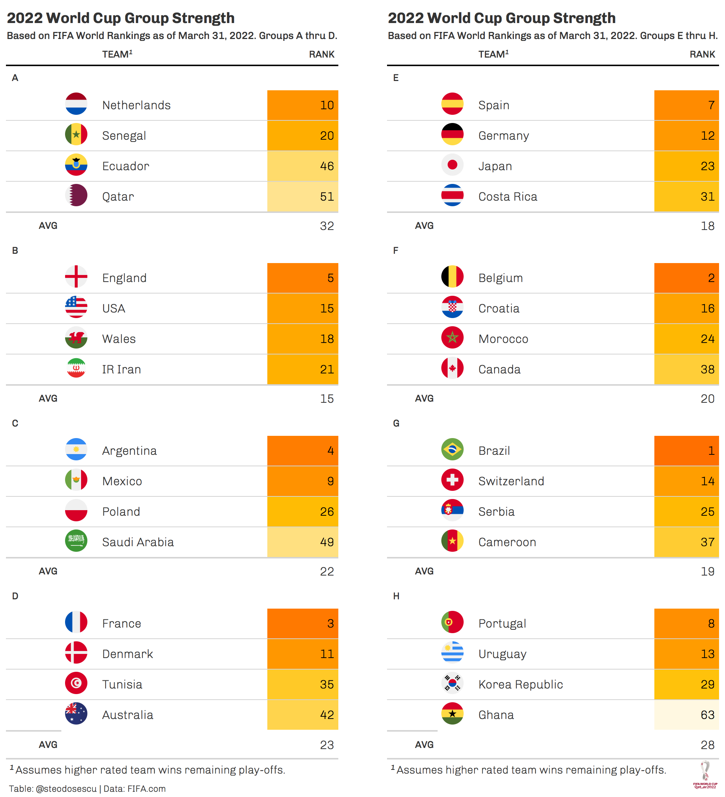

# World-Cup
Repo for my 2022 World Cup predictions and analysis

## Modeling and Simulation for the 2022 FIFA World Cup in Qatar
* wc_model.R: Poission regression model to predict and simulate the 2022 Men's FIFA World Cup
* results.csv: Data for intertional soccer matches dating back to 1872.
* fixtures.csv: Fixtures and results for matches played in the 2022 FIFA World Cup
* rankings.csv: International soccer rankings producted from model coefficients.
* wc_sims.csv: Up to date probabilities for each country to advance to each round of the World Cup.

More to come...

