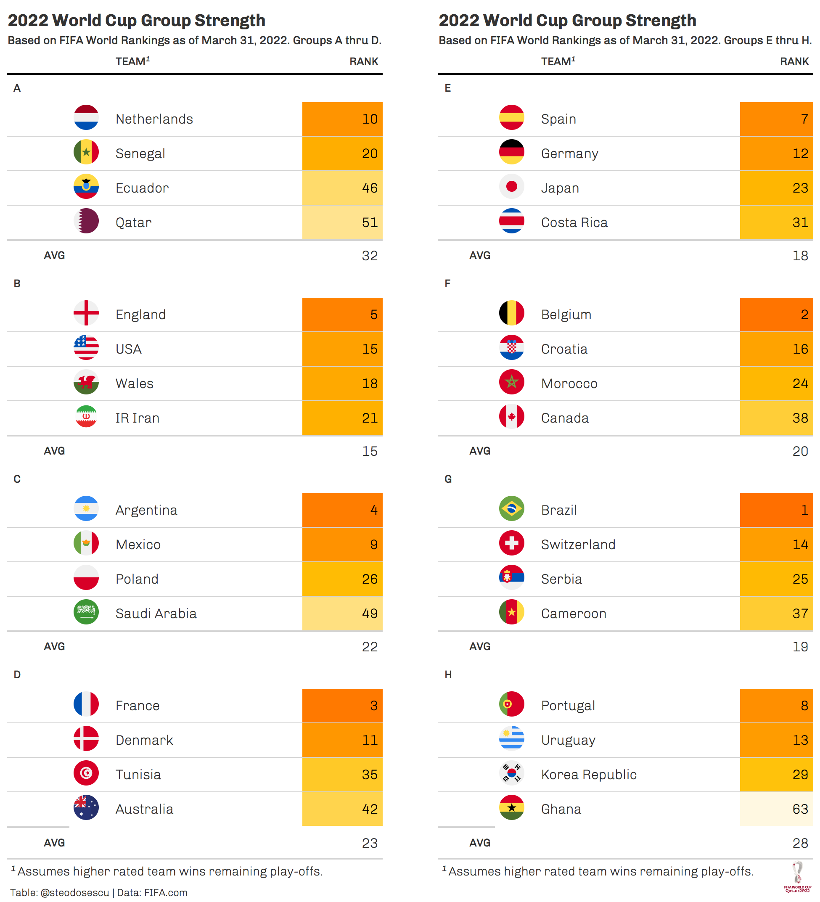

This website is an experimental/hobbyist project, and your home for everything 2022 World Cup analytics.

Calculating Individual Match Outcomes
------------

From a high level the model works as follows: We identify the goal scoring and conceding rates of each team, then use these ratings to forecast the expected number of goals to be scored in matches that haven't taken place yet. These expected goals are used to calculate the probabilities of the various outcomes (home win, draw, away win), which assumes the number of goals scored in soccer follow a Poisson distribution. From there we simulate these results with the predicted probabilities 10,000 times to identify the most likely outcomes for the season. 

The first step in the analysis is to get match data and create arrays with the games played thus far into the season. I'm using data from the fantastic [football-data.co.uk](http://www.football-data.co.uk) website. To create odds for each match outcome in the season, I'm using Mark Taylor’s approach by creating match result probabilities [described here](http://thepowerofgoals.blogspot.com.cy/2016/02/how-to-frame-individual-match-outcome.html) using historical goals scored. He uses Expected Goals to create these odds, but I've substituted that with publicly available Actual Goals. This method works better the deeper we are into the season as variance from teams' true finishing ability vs their goal figures evens out of the course of the year. 

As described by Taylor, the method uses 1) the average number of goals scored by home and away teams in the given campaign and 2) The average number of goals scored and conceded by the two teams in question in any match. As an example, let's do this analysis for a single match: Burnley at home vs. Liverpool. And let's say Home teams are scoring 0.25 goals per game more than visitors -- 1.49 compared to 1.24, and the average game has 1.37 expected goals per team.

Note GS = Goals Scored and GC = Goals Conceded in the table below.

| Avg GS by Home Teams | Avg GS by Away Teams | Avg GS/GC by all teams | Avg GS  by Burnley | Avg GC by Burnley | Avg GS by Liverpool| Avg GC by Liverpool |
| --- | --- | --- | --- | --- | --- | --- |
1.49 | 1.24 | 1.37 | 1.09  | 1.91 | 1.92  | 1.16

This means we expect Burnley to score 1.00 goal and Liverpool 2.43 goals in an upcoming game. The math to get there: Burnley are scoring an average of 1.09 goals per match, thus are scoring (1.09/1.37) = 0.79times the rate of average scoring in the competition. Liverpool allow 1.16/1.37 or 0.85 times the rate of conceding in the competition. Burnley are at home and home teams score 1.49/1.37 or 1.09 times the average rate for this year's campaign. Thus, multiplying these rates together, Burnley are expected to score 0.79 * 0.85 * 1.09 * 1.37 = 1.0 goals in this matchup. Likewise we can do the same for Liverpool:

Liverpool score 1.92/1.37 = 1.40

Burnley allow 1.91/1.37 = 1.39 times league average.

Away teams score 1.24/1.37 = 0.91 times league average.

Liverpool are likely to score 1.40 * 1.39 * 0.91 * 1.37 expected goals = 2.43 expected goals.

Goals scoring in soccer is known to follow a Poisson distribution. Thus if we plug these figures into a Poisson model, we get the following match predictions

Burnley Win | Draw | Liverpool Win
--- | --- | ---|
14% | 18% | 64% 

Simulating all season fixtures
------------

The above shows how we get to probabilities for individual match outcomes. Next, we use these outcomes to simulate an entire season...10,000 times. For this model we're using independent Poisson distributions to simulate results from. Based on the model estimates for single matches, Monte-Carlo simulations are then used to estimate probabilities for reaching the different stages in the tournament for all teams.

Visualizing the results
------------

Using the `df.all` output dataframe we can create myriad data visualizations to show the range of outcomes for each Premier League team. I use the Tidyverse Googlesheets API to write this dataset to Google Sheets so we can subsequently use Tableau's Web Data Connector functionality to layer on visualizations in Tableau. We can use the CronR addin for RStudio to schedule our R script to run on a defined weekly cadence to ensure we have the latest league results accounted for.

In addition, we  can create a few graphs in R as well. This one was generated as of Matchweek 9.

Data
------------

The data come from [football-data.co.uk](http://www.football-data.co.uk/), and is refreshed after all the games have been completed for the week, usually on Mondays.

Learn More
------------

You can read more at my blog [Between the Pipes](https://betweenpipes.wordpress.com/). 

***

## Resources and Inspiration

The below resources were used to access Formula 1 data and create the tables and plots you see on this site. It was created exclusively using R, a language for statistical programming. Many thanks to all the authors of these fantastic resources:  

| Title/Link | Author | Description |
| :--- | :--- |:---------------|
| [R for Data Science](https://r4ds.had.co.nz/) | Hadley Wickham, Garret Grolemund | A great overview of the `tidyverse`, covers everything from reading data in, data manipulation/summarization, data viz, and general programming in R |
| [Ergast API](http://ergast.com/mrd/) | Chris Newell | The ergast experimental Motor Racing Developer API provides a historical record of Formula One results data dating back to 1950. |
| [R Markdown Intro Guide](https://rmarkdown.rstudio.com/lesson-1.html) | R Studio | Intro primer to authoring R Markdown documents.: |
| [`ggplot2` Cookbook](http://www.cookbook-r.com/Graphs/) |  Winston Chang | Quick cookbook of `ggplot2` plots |
| [Making Websites in R Markdown](https://www.p8105.com/making_websites.html) |  Jeff Goldsmith | Nice introduction from his course at Columbia on how to make websites using only R and Rstudio. |
| [R Markdown Book ](https://bookdown.org/yihui/rmarkdown/) | Yihui Xie, J. J. Allaire, Garrett Grolemund | The definitive guide outlining what you can do with the rmarkdown package (Allaire, Xie, McPherson, et al. 2021), which was first created in early 2014. The package has steadily evolved into a complete ecosystem for authoring documents in a variety of output formats including the output of this document that you're reading. |

